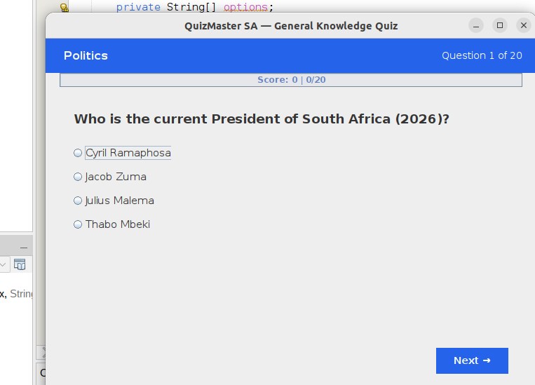
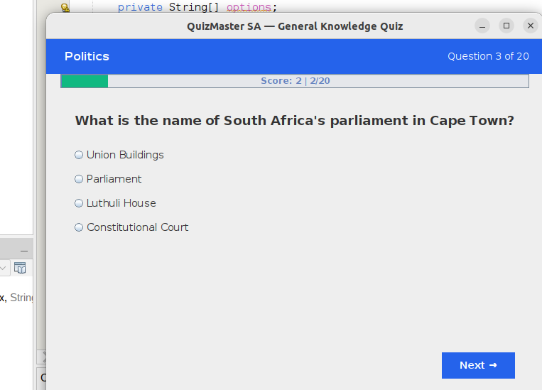
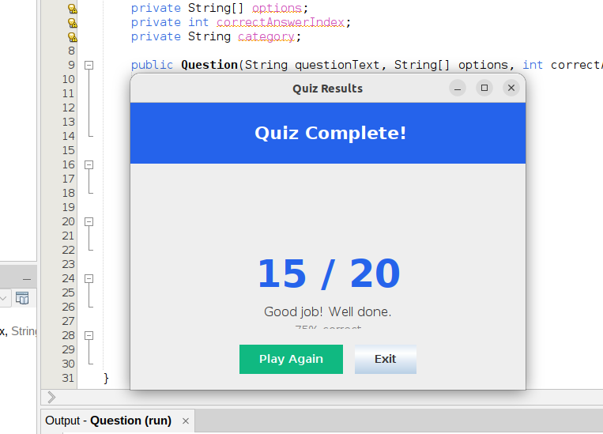

# 🎯 QuizMaster SA

A Java Swing GUI general knowledge quiz application built in NetBeans.

## Features

- 4 categories: Politics, Economics, Personal Life, General Knowledge
- 20 multiple-choice questions (5 per category)
- Progress bar with live score tracking
- Results screen with emoji feedback and percentage
- Answer validation (must select before continuing)
- Restart or exit options
- Clean, modern UI with gradient headers

## Tech Stack

- Java 17+
- Java Swing (desktop GUI)
- NetBeans IDE

## Screenshots

### Question Screen

### Progress Tracking

### Final Results

## How to Run

1. Clone the repository:
       git clone https://github.com/Thapelo-Makama/QuizMasterSA.git

2. Open the project in NetBeans:
   - File → Open Project → select QuizMasterSA

3. Run:
   - Right-click Main.java → Run File
   - Or press Shift + F6

## Author

**Thapelo Makama**
- Computer Science Student | TUT
- GitHub: [@Thapelo-Makama](https://github.com/Thapelo-Makama)
